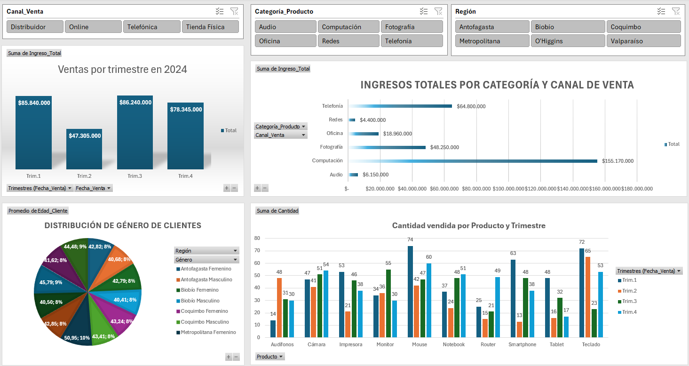

# Análisis Exploratorio de Ventas 2024

Proyecto de análisis de datos utilizando Excel para estudiar ventas y comportamiento de clientes.

## Descripción breve:
Este proyecto incluye:
- Estadística descriptiva básica
- Dashboard interactivo
- Segmentaciones por canal, categoría, región, etc.

## Archivos:
- [Base de Datos](./Base_de_Datos_Ventas.xlsx)
- [Dashboard de Ventas (PDF)](./Dashboard_Ventas.pdf)
- [Informe Final del Análisis (PDF)](./Informe_Analisis_Ventas.pdf)

## Visualizaciones destacadas:

## Autor:
Tu Nombre – [LinkedIn](https://www.linkedin.com/in/cgaeter/)
